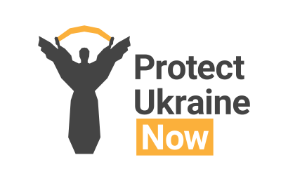

import WeaponsIncome from '@components/WeaponsIncome/index.astro'

### The Goals of the Project

`<WeaponsIncome />`

The Protect Ukraine Now Project is an initiative of individuals who deeply care of Ukrainians and Ukraine and have a strong will and desire to help Ukraine withstand unprovoked aggression by the Russian Federation, win the war and save as many Ukrainian lives as possible.

The project participants believe this conflict has no diplomatic resolution, and in order to ensure long-term peace in Ukraine, the Russian Federation must suffer a complete military defeat in the war they have started.The main objective of the project is as follows:

**Prevent the evolution of the assault on Ukraine into a Protracted War and aid to military defeat of the Russian Federation in Ukraine in the most immediate future.**

The Protect Ukraine Now project participants, through data review and analytics, have arrived at the conclusion, the current strategy, used by the collective West, needs a significant revision. Should it remain unchanged, the current strategy will inevitably lead to a multi-year conflict with an astonishing death toll and destruction. The Project is resisting this outcome by the following means:

1.  Provides unbiased and complete informing to the general public about the real situation with military aid to Ukraine. This is necessary to resist misleading and inaccurate data that exists in abundance in the information space.
    
2.  Communicates to the general public the importance of the constant contact with their elected officials regarding support for Ukraine, as this is the most efficient way of making a difference in the current political process.
    
3.  Facilitating a way for the United States residents to reach out to their congressmen via an online form available on our website. The Project provides the site visitors with a template, which they can use as a letter of support for Ukraine to their congressmen or they can write their own letter of support.
    
4.  Increased public awareness about the Project through promoting its content via social media and other means of communication.
    

### The Fundamental Principles of the Project

The ProtectUkraineNow.org Project is a Non-Governmental Organization (NGO). The participants of the project are volunteers from various countries around the world.

The project participants are united by a common goal, therefore all project participants treat each other and the activities of each participant in the project with respect, regardless of age, experience, previous merits, nationality, religion, political views, etc.

The project participants agree that the objectivity and accuracy of providing information and the protection of the people of Ukraine is of greater importance than their own political, religious, national or other personal preferences.

### How Can You Help?

1.  The effectiveness of our project is directly related to the number of people we can reach. Please help us with the distribution of information about the Protect Ukraine Now Project among your acquaintances, friends, colleagues, relatives in the USA and around the world. Please follow us on Facebook, like and share our publications.
    
2.  The US residents can use our website to submit a letter of support for Ukraine to your representatives in Congress. Writing to Congress is the most efficient way to make your voice heard and make a difference. This way of participation in the political process is one of the fundamental principles of democracy and should be taken with the appropriate seriousness.
    
3.  If you would like to join the project and you have skills in the following areas: marketing, SMM, programming, illustration, website development, translation (Ukrainian, English, other European languages), please contact us with your offer to help and a description of your specialization at [ProtectUkraineNOW@gmail.com](mailto:ProtectUkraineNOW@gmail.com)
    

### The Data and the Analytics

The goals stated above are achieved by the means of creating and refreshing a digest with the key news; providing the information about military aid supplied to Ukraine by allies.

The Protect Ukraine Now Project is only using publicly available data sources and all the appropriate references are cited on the project website.

### How Can Protect Ukraine Now Help?

**We are totally open to mutual cooperation with any organizations whose goal is to ensure the earliest possible victory for Ukraine.**